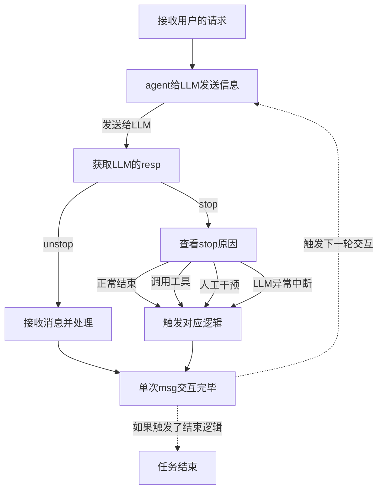

# X Claude Code 设计思路总结

## 一、agent基础循环框架



## 二、tools模组设计

- ToolBase，基础工具类

  ```python
  # 使用抽象类来定义工具的属性和方法
  class ToolBase(ABC):
      """anthropic-tools基类"""
      name: str
      description: str
  
      @abstractmethod
      def execute(self, *args, **kwargs) -> ToolResp:
          """
          调用tool的具体逻辑，由具体的实现类完成
          :param args: agent内部传递的参数，目前只有session，后面如果有就往后添加
          :param kwargs: AI模型调用工具提供的参数
          :return: ToolResp  工具调用返回值，包含调用状态，简单回调文本和复杂返回对象
          """
          raise NotImplementedError
  
      # 这个是针对anthropic规范的工具信息打包方法，后续要用其他平台的话，再写新方法就行
      def get_anthropic_schema(self) -> dict:
          """获取 Anthropic 格式的工具定义"""
          return {
              "name": self.name,
              "description": self.description,
              "input_schema": self._get_input_schema()
          }
  
      @abstractmethod
      def _get_input_schema(self) -> dict:
          """子类实现，返回输入参数的 JSON Schema"""
          raise NotImplementedError
  ```

  

- 初始化和调用流程（具体可以看tools_manager.py里面的逻辑）

  ```mermaid
  graph TD
      AI[AI大模型]
      M[工具管理中心] 
      C[定义好的工具实现类]
      F[具体方法逻辑]
      
  		M --管理--> C 
  		AI --调用工具--> M
  		M --推送工具信息--> AI
  		C --注册工具方法--> M
  		C -.底层实现.- F
  
  		M --根据模型需要路由到对应方法--> C
  
  ```
  
  

