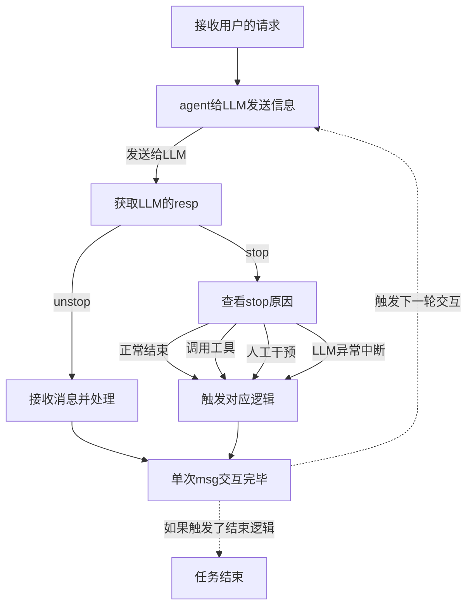

# X Claude Code 设计思路总结

## 一、agent基础循环框架

```mermaid
graph TD
    Start[接收用户的请求]
    A[agent给LLM发送信息] 
    B[获取LLM的resp]
    R[查看stop原因]
    R1[触发对应逻辑]
    L[一次循环完毕]
    M[接收消息并处理]
    
    Start --> A
    A--发送给LLM-->B
    B --stop--> R
    B --unstop--> M --> L
    R --正常结束--> R1
    R --调用工具--> R1
    R --人工干预--> R1
    R --LLM异常中断--> R1
    R1 --> L[单次msg交互完毕] -.触发下一轮交互.-> A
    L -.如果触发了结束逻辑.-> Z[任务结束]
```

## 二、tools模组设计

## 三、安全验证设计思路

