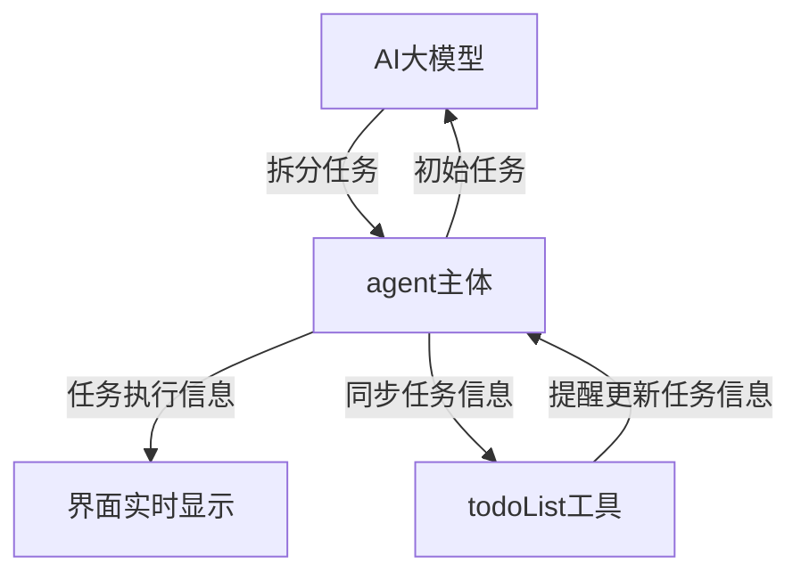

# agent任务拆分模块

## 一、设计思路

- **系统提示词层面支持：**要求任务开始执行时进行任务拆分并指定接收任务拆分信息的工具（方法）
- **todoList流程控制工具：**包括定义任务拆解格式、同步todoList执行情况

## 二、流程图



# agent会话管理

## 一、设计思路

- 每个会话对应一个agent_loop
- 会话内部同步执行，拥有自己的单独的资源，没有并发问题
- 不同会话间异步执行，互相不影响，通过会话来控制并发，后续要接入fastapi，细节还要调整
- 会话绑定跟路径，方便会话管理和权限管理，根路径下的权限比较大

## 二、代码实现

```python
# 会话实体类
class Session:
    id: str                     # 会话ID
    # user_id: str              # 用户ID，后续扩展添加
    name: str                   # 会话名称，也是会话描述
    root_path: str              # 会话根路径，也就是创建会话的路径
    white_path: set[str]        # 当前会话白名单
    create_time: datetime       # 会话创建时间
    last_time: datetime         # 会话最近活跃时间
      
# 会话集合，按照根路径存放会话信息
# 后续要接数据库进行持久化
sessions: dict[str, list[Session]] = {}
session_lock = threading.Lock()
```

